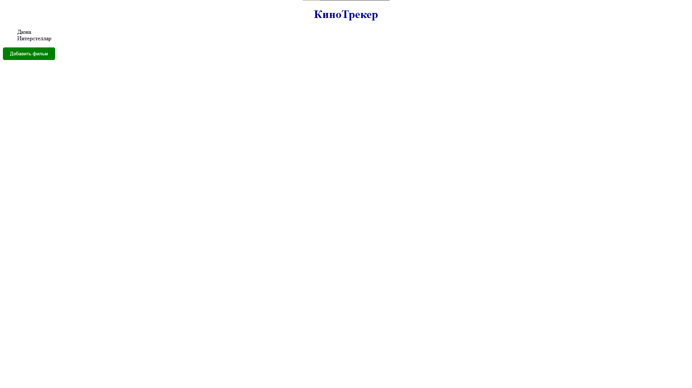
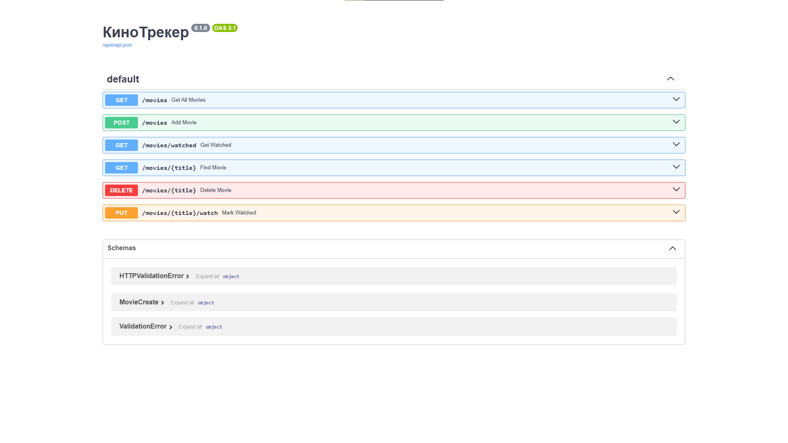

# 🎬 КиноТрекер

Трекер фильмов и сериалов с REST API и веб-интерфейсом. Учебный проект для портфолио Python-разработчика.

## 🛠 Стек

- **Python 3.9+**
- **FastAPI** — бэкенд и REST API
- **HTML5, CSS3, JavaScript** — фронтенд
- **JSON** — хранение данных

## 📸 Скриншоты




## 🚀 Запуск

1. Клонируй репозиторий:
   ```bash
   git clone https://github.com/denisprokhorovru/kinotracker.git
   cd kinotracker

2. Создай виртуальное окружение и активируй его:
   ```bash
   python -m venv .venv
   .venv\Scripts\activate  # Windows

3. Установи зависимости:
   ```bash
   pip install fastapi uvicorn

4. Запусти сервер:
   ```bash
   uvicorn api:app --reload

5. Открой в браузере:

- Фронтенд: открой файл index.html
= API документация: http://127.0.0.1:8000/docs

## 📡 API Эндпоинты

| Метод | URL | Описание |
|-------|-----|----------|
| `GET` | `/movies` | Список всех фильмов |
| `GET` | `/movies/{title}` | Найти фильм по названию |
| `GET` | `/movies/watched` | Просмотренные фильмы |
| `POST` | `/movies` | Добавить фильм |
| `PUT` | `/movies/{title}/watch` | Отметить как просмотренный |
| `DELETE` | `/movies/{title}` | Удалить фильм |

## 📁 Структура проекта

kinotracker/
    ├── api.py # FastAPI приложение
    ├── movie_class.py # Классы Movie и MovieTracker
    ├── movies.json # Данные фильмов
    ├── index.html # Фронтенд
    ├── app.js # JavaScript (логика фронтенда)
    └── README.md # Документация

## ✅ TODO

- [ ] Переезд на PostgreSQL + SQLAlchemy
- [ ] Docker
- [ ] PyTest
- [ ] Django версия